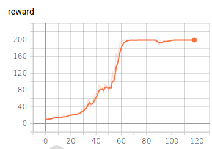
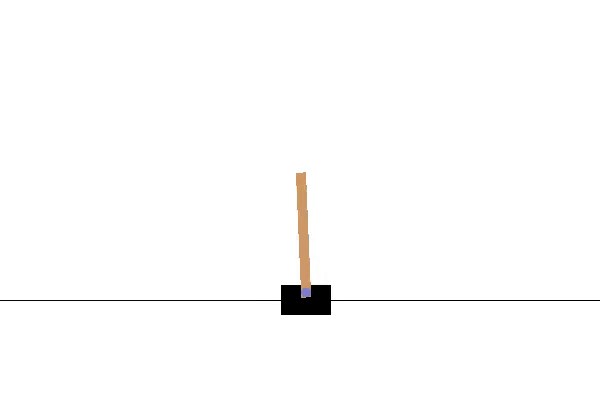

# Whats this

This is a very simple implementation for [Path Consistency Learning (PCL)](https://arxiv.org/abs/1702.08892).
It currently only supports environments with a discrete action space
and very simple environments.

# Usage

First install the requirements
```
$ pip install -r requirements.txt
```

To run training on the CartPole environment:
```
$ python main.py
```
This logs the loss, reward and average sequence length to
tensorboard, which can be viewed with
```
$ tensorboard --logdir=runs
```

# Results

A very simple model for the cartpole environment is provided
under res/models/cart_pole.

U can see it acting by running:
```
$ python test_model.py
```



